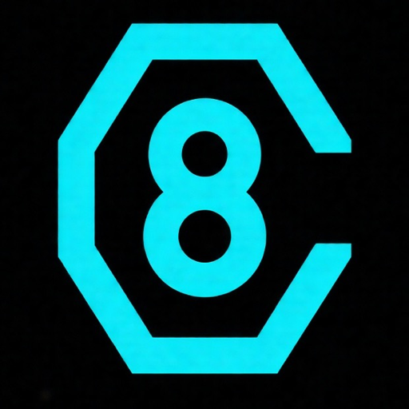
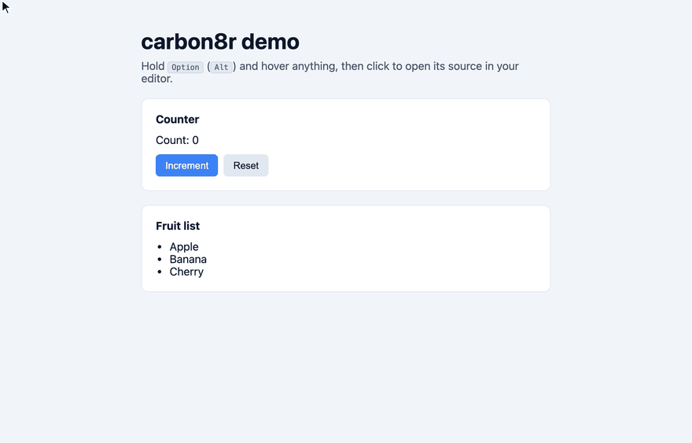

<p align="center">
  
</p>

<h1 align="center">carbon8r</h1>

<p align="center">
  <a href="https://www.npmjs.com/package/vite-plugin-carbon8r"></a>
  <a href="LICENSE"></a>
  
</p>

<p align="center">
  A LocatorJS-style "jump to source" tool that works with <strong>React 19</strong>.
</p>

<p align="center">
  
</p>

Hold <kbd>Option</kbd> (<kbd>Alt</kbd>) in the browser: hovering any element
highlights its box model with DevTools-style colors — blue content, green
padding, orange margin — and shows the component name plus `file:line:column`.
Click while holding the key and the file opens in your editor at that exact
position. Elements without source info (component libraries, any web page via
the extension) still get the box-model inspector.

## Why this exists

LocatorJS (and click-to-component, etc.) read `fiber._debugSource` — source
positions that React stored on elements when Babel's dev transform passed a
`__source` prop. **React 19 removed `__source`/`_debugSource` entirely**, which
broke every runtime-only jump-to-source tool. React 19 dev builds capture `_debugStack`
(a raw `Error` stack) instead, but turning that into original source positions
requires stack parsing plus sourcemap resolution — fragile and browser-specific.

This project takes the robust path instead: inject the source location at
**build time** as a `data-carbon8r` attribute on every host JSX element. No React
internals are touched, so it works with React 19 today and whatever React 20
does tomorrow.

## Install

```sh
npm install -D vite-plugin-carbon8r   # Vite
npm install -D next-carbon8r          # Next.js
```

## Usage

### Vite

```js
// vite.config.js
import { defineConfig } from 'vite'
import react from '@vitejs/plugin-react'
import carbon8r from 'vite-plugin-carbon8r'

export default defineConfig({
  plugins: [react(), carbon8r()]
})
```

That's the entire setup. The plugin only runs on the dev server (`apply:
'serve'`) — production builds are completely untouched.

### Next.js

Wrap the config, then render the overlay once in your root layout:

```js
// next.config.mjs
import withCarbon8r from 'next-carbon8r'

export default withCarbon8r({})
```

```jsx
// app/layout.jsx
import { Carbon8r } from 'next-carbon8r/client'

export default function RootLayout({ children }) {
  return (
    <html lang="en">
      <body>
        {children}
        <Carbon8r />
      </body>
    </html>
  )
}
```

Works with Turbopack and webpack, on both server and client components.
Alt-click reuses Next's own `/__nextjs_launch-editor` endpoint, so there is
nothing else to configure. See
[`packages/next-carbon8r`](packages/next-carbon8r) for the full options list.

### Editor options (both packages)

By default clicks are sent to the dev server, which opens your editor
server-side — Vite via
[launch-editor](https://github.com/yyx990803/launch-editor) (respects
`$EDITOR` / `$LAUNCH_EDITOR`), Next via its own built-in launch-editor route
(respects `$EDITOR` / `$REACT_EDITOR`). No browser protocol dialogs involved.

To force a specific editor via a protocol URL instead — useful when the
browser and the dev server aren't on the same machine — both accept the same
`editor` option:

```js
// Vite
carbon8r({ editor: 'cursor' })

// Next.js
withCarbon8r(nextConfig, { editor: 'cursor' })
```

Presets: `vscode`, `vscode-insiders`, `cursor`, `windsurf`, `zed`. Or pass any
template: `'myeditor://open?file={file}&line={line}&col={column}'`.

## Try the demo

```sh
npm install
npm run dev
```

Open http://localhost:5173, hold <kbd>Option</kbd>/<kbd>Alt</kbd>, hover, click.

For the Next.js demo:

```sh
npm run dev -w demo-next
```

Open http://localhost:4300 and do the same.

## Browser extension

`packages/carbon8r-extension` ships the same overlay as a Chrome (MV3)
extension, for pages that carry `data-carbon8r` attributes but don't inject the
runtime themselves — e.g. a teammate's dev server, or when you want your own
editor settings independent of the app's config. The extension can't do the
build-time half; the app still needs `vite-plugin-carbon8r` (or anything else
that emits `data-carbon8r="file:line:column"` attributes).

```sh
npm run build -w carbon8r-extension
```

Then `chrome://extensions` → enable **Developer mode** → **Load unpacked** →
select `packages/carbon8r-extension/dist`. It runs only on `localhost` /
`127.0.0.1`, stands down automatically when the page already injects the
overlay, and has a popup for settings: **Auto** (default — the app's dev server
opens your editor via launch-editor), an editor preset, or a custom URL
template. Protocol editors need the project's absolute root path, set in the
popup. The content script is generated from the plugin's `runtime/overlay.js`
at build time, so the two stay identical.

## Packages

| Package | What it is |
| --- | --- |
| [`carbon8r-core`](packages/carbon8r-core) | The JSX transform and the overlay runtime, shared by everything below. |
| [`vite-plugin-carbon8r`](packages/vite-plugin-carbon8r) | Vite dev-server plugin. |
| [`next-carbon8r`](packages/next-carbon8r) | Next.js loader + config wrapper + `<Carbon8r />`. |
| [`carbon8r-extension`](packages/carbon8r-extension) | Browser extension; inlines the core overlay as its content script. |

## How it works

`packages/vite-plugin-carbon8r` does two things, both dev-only:

1. **Transform** (`enforce: 'pre'`, so it sees the original source before
   `@vitejs/plugin-react`): parses each `.jsx`/`.tsx` file with `@babel/parser`
   and uses `magic-string` to append two attributes to every *host* element
   (lowercase tags only — components are skipped so no unknown props leak into
   them):

   ```jsx
   <button data-carbon8r="src/components/Button.jsx:3:5" data-carbon8r-name="Button">
   ```

   The component name is the nearest enclosing named function
   (`function App()`, `const Button = () => …`, class components).

2. **Runtime injection**: `transformIndexHtml` adds a script tag for a virtual
   module (`/@carbon8r/runtime`) that renders the overlay in a shadow root
   (z-index max, `pointer-events: none`, immune to app CSS). While Alt is
   engaged over a target, the whole gesture family (`pointerdown`, `mousedown`,
   `mouseup`, `click`, `auxclick`, `contextmenu`) is swallowed in the capture
   phase, so neither the app's handlers nor the native context menu fire —
   some environments translate Alt+click into a right-click, and Alt+right-click
   opens the source too. Activation reads both Alt keydown/keyup *and* the
   `altKey` flag on mouse events, so it stays in sync even when keyboard events
   don't reach the page (webviews, OS shortcut utilities, automation).
   Clicks hit a small dev-server endpoint (`/__carbon8r/open`, path-guarded to
   the project root) that launches the editor server-side.

A debug handle is exposed at `window.__CARBON8R__`
(`{ config, active, target, activate(), deactivate(), hrefFor(el) }`).

## Limitations / roadmap

- **Host elements only.** Clicking a `<Button>` instance jumps to the root
  element inside `Button.jsx` (its definition), not the usage site. Showing the
  whole owner chain (like LocatorJS's component tree popup) would mean walking
  React fibers — doable in React 19 via the `__reactFiber$*` DOM keys, just not
  built yet.
- **Vite and Next.js.** Other bundlers aren't covered yet, but the transform
  and the overlay both live in `carbon8r-core`, so an Rspack loader or a plain
  Babel plugin would be a thin wrapper around `injectLocations()` plus a call
  to the shared `install()`.
- **No zero-config browser extension mode.** That's the one thing the original
  LocatorJS extension did that build-time injection can't: work on apps you
  don't control. A React 19 version would parse `fiber._debugStack` and resolve
  positions through the dev server's sourcemaps — feasible, but a separate
  project-sized effort.
- Styled-components/emotion tags (`const X = styled.div`) are capitalized, so
  they're currently skipped.

## Acknowledgements

- [LocatorJS](https://github.com/infi-pc/locatorjs) by Michael Musil pioneered
  the hold-Option-and-click jump-to-source workflow that carbon8r recreates
  for React 19. carbon8r is an independent, from-scratch implementation and
  shares no code with LocatorJS — but the interaction design came from there.
- [click-to-component](https://github.com/ericclemmons/click-to-component) by
  Eric Clemmons is prior art for the same workflow.
- The box-model highlight colors (blue content, green padding, orange margin)
  are the classic Chrome DevTools inspector palette.
- Editor launching is powered by
  [launch-editor](https://github.com/yyx990803/launch-editor) by Evan You.

## License

[MIT](LICENSE)
